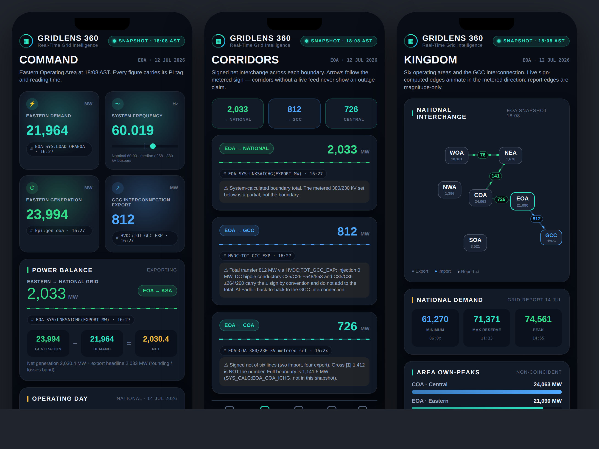

# GridLens 360 — Real-Time Grid Intelligence

A native SwiftUI iPhone app: a boardroom-grade executive dashboard of the Saudi
Electricity Company **Eastern Operating Area (EOA)** transmission grid, built for
C-level viewers (executives, VPs, board, ministry) who must understand the grid at a
glance. It is the iOS successor to the single-file Grid Time Lens (GTL) dashboard.



*Design preview rendered on the build host. The shipped UI is native SwiftUI with live
motion (flowing corridor dashes, count-up KPIs, animated schematic and gauges).*

## What it shows

Five boards, driven entirely by a frozen PI-System telemetry snapshot (12 Jul 2026,
reporting window 01:08–18:08 AST, header as-of 18:08):

- **Command** — four hero KPIs (Eastern demand 21,964 MW · frequency 60.019 Hz ·
  generation 23,994 MW · GCC export 812 MW), the export headline (2,033 MW to the
  national grid) with the arithmetic balance proof, and the operating-day curve through
  the three measured national points.
- **Corridors** — signed net interchange across each boundary (→ National 2,033 · → GCC
  812 · → Central 726 · → NE pocket 114.2), with metered legs, partial-vs-boundary
  caveats, and direction computed from the sign of the MW.
- **Kingdom** — the six-area national schematic with animated inter-area flows, the
  demand markers (61,270 / 71,371 / 74,561), area own-peaks, the +368 non-coincidence
  proof, and the reserve stack.
- **Sources** — renewables (10,156 MW national = 13.62% of peak; 674.9 MW eastern),
  battery storage, and the Aramco / GCCIA data-exchange interfaces.
- **Ledger** — the numbers auditing themselves (every headline sum re-derived in code),
  the honest-limits ledger, the telemetry census, and the About / credits card.

## Design principles (the binding laws, enforced in code)

1. **No invention.** Every displayed number carries a PI tag / feed apply-key and a
   timestamp from the source, or an honest derivation descriptor — never a fabricated
   tag. Sums are re-derived at runtime in `GridSnapshot.selfCheck()`.
2. **Direction is computed from the signed MW at render**, never asserted. Corridors
   without a live feed never show an outage claim.
3. **Partial ≠ boundary.** Per-tie metered sums are labelled as partials, not boundary
   totals.
4. **Two honest countings are labelled, never forced equal** (e.g. the renewable rings
   vs. the wind/PV split; the two signal censuses; GCC 812 vs. 821.25).
5. **Telemetry-framed, English only, snapshot-honest.** The header reads SNAPSHOT and
   would flip to LIVE only when fed.

## Architecture

Pure SwiftUI, no third-party dependencies, fully offline.

```
GridLens360/
  GridLens360App.swift      @main + animated boot screen
  RootTabView.swift         5-board TabView + shared header
  Model/GridData.swift      the Numbers Bible — every value + provenance + self-check
  Theme/Theme.swift         colour / type / motion design system
  Components/               TagChip, CountUpNumber, gauges, flow lines, charts
  Screens/                  Command, Corridors, Kingdom, Sources, Ledger
  Assets.xcassets/          app icon + accent colour
```

Data is a bundled, immutable snapshot (`GridSnapshot.eoa`). The model exposes a clean
seam (`MetricBasis.live`) for a future PI Web API feed, but v1.0 ships the snapshot only —
an iPhone on TestFlight cannot reach the internal PI network, and the board is honestly
stamped SNAPSHOT.

## Build & ship

See **[BUILD.md](BUILD.md)** for the exact Xcode → archive → TestFlight steps, matching
the Apple Developer configuration (bundle `com.mohamedalsaeed.gridlens360`, team
`Y94NRXX75N`, automatic signing, v1.0 build 1).

Requires **Xcode 16+** on macOS (the project uses file-system-synchronized groups).

## Provenance

Owner: **Mohammed Alsaeed** · Digitalization Team · Grid Operator Sector ·
Operations & Control — EOA. Source: frozen PI-System snapshot + the 14-Jul national
Grid-Report block.
